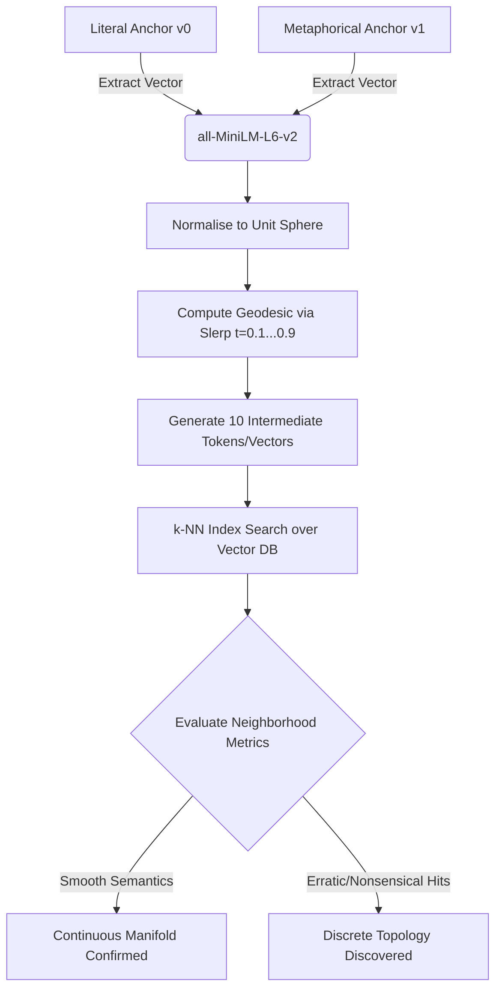
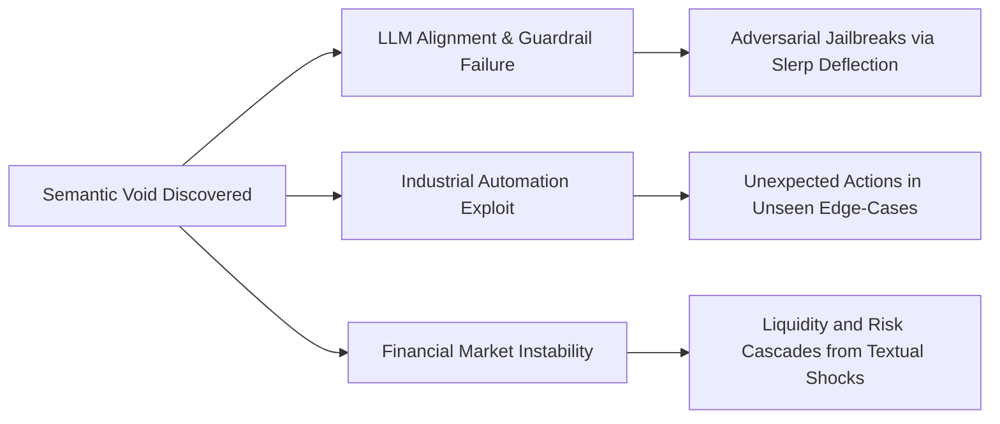

Automated geometric and topological analysis engine to test the differentiability of natural language embeddings using Spherical Linear Interpolation (Slerp) and FAISS neighbourhood density metrics.

# Metaphorical Void Analyser: Latent Manifold Differentiability Engine

This repository provides a validation pipeline to stress-test a foundational assumption in modern Natural Language Processing: Are semantic vector spaces truly continuously differentiable manifolds, or are they discrete, anisotropic graphs punctuated by non-semantic vacuums ("empty space")?

By tracking structural transitions along the geodesic path between literal statements (e.g., "The machine ceased to function due to broken gears") and their metaphorical equivalents ("The bureaucratic system broke down entirely"), this engine maps out the underlying topology of pre-trained language models.

# Core Methodology & Pipeline

# Expected Key Diagnostic Analytics

The program automatically renders dual-axis structural charts using matplotlib to evaluate the manifold's integrity:

Manifold Uniformity Check: Monitors drops in cosine similarity over the trajectory parameter t. Sharp dips identify unindexed, non-semantic "voids.
"Smoothness Check: Validates whether the semantic drift matches a constant-velocity parallel transport or displays chaotic, non-linear jumps.

# Failure Mode Analysis

